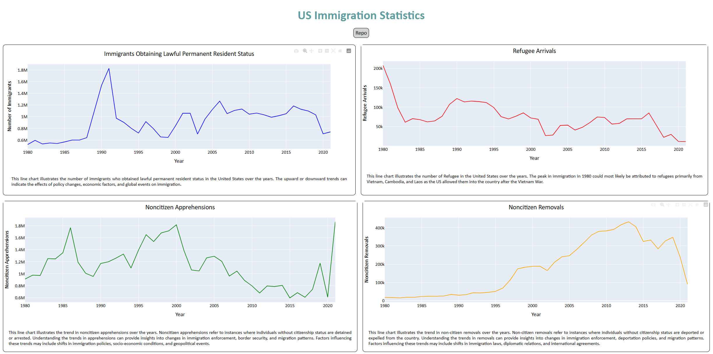

# US-Immigration-Statistics-Dashboards

## Description

This project provides interactive dashboards to visualize US immigration statistics over time. Utilizing Dash, Plotly, pandas, and other Python libraries, the dashboards offer insights into various types of delays affecting flights within the United States. The visualizations include carrier delays, weather delays, NAS delays, security delays, and late aircraft delays, presented in a user-friendly interface.

## Table of Contents 
	
- [Installation](#installation)
- [Usage](#usage)
- [Methodology](#methodology)
- [Results](#results)
- [Conclusion](#conclusion)
- [License](#license)

## Installation

To run this project locally, follow these steps:

1. Clone the repository:
    ```bash
    git clone https://github.com/CxLos/US_Immigration_Statistics
    ```
2. Navigate to the project directory:
    ```bash
    cd US-Immigration-Statistics
    ```
3. Install the required dependencies:
    ```bash
    pip install -r requirements.txt
    ```

## Usage

- This is an interactive Plotly/Dash dashboard. Please feel free to hover over any interesting data points that you would like to take a deeper dive on and zoom or zoom out to get a better view.

- To launch the dashboard, execute the following command in your terminal or click the following link:

  - [US Immigration Statistics Dashboard](https://us-immigration-statistics-b0f238985cfe.herokuapp.com/)

```bash
python us-immigration.py
```



## Methodology

The data for this project was sourced from Kaggle. The link to the data can be found here: 

[Global Demographic Dynamics: Population Trends](https://www.kaggle.com/datasets/programmerrdai/global-demographic-dynamics-population-trends)

### Plans for collected data:

- Explore additional datasets related to immigration trends, such as visa categories, country-specific immigration patterns, and demographic information of immigrants.
- Integrate real-time data sources or regularly updated datasets to keep the immigration statistics dashboard current and reflective of ongoing trends.
- Enhance data visualization capabilities by incorporating interactive maps, network graphs, and temporal analysis tools to provide a comprehensive view of immigration dynamics.
- Implement sentiment analysis or natural language processing (NLP) techniques to analyze public discourse and media coverage related to immigration, offering contextual insights into immigration trends.
- Collaborate with governmental agencies, research institutions, and advocacy groups to access authoritative immigration data and ensure data accuracy and relevance.
- Develop machine learning models to forecast future immigration trends based on historical data, policy changes, economic indicators, and geopolitical events.

## Results

### Immigrants obtaining Lawful Permanent Status

* This line chart illustrates the number of immigrants who obtained lawful permanent resident status in the United States over the years. The upward or downward trends can indicate the effects of policy changes, economic factors, and global events on immigration.

### Refugee Arrivals

* This line chart illustrates the number of Refugee in the United States over the years. The peak in immigration in 1980 could most likely be attributed to refugees primarily from Vietnam, Cambodia, and Laos as the US allowed them into the country after the Vietnam War.

### Non-citizen Apprehensions

* This line chart illustrates the trend in noncitizen apprehensions over the years. Noncitizen apprehensions refer to instances where individuals without citizenship status are detained or arrested. Understanding the trends in apprehensions can provide insights into changes in immigration enforcement, border security, and migration patterns. Factors influencing these trends may include shifts in immigration policies, socio-economic conditions, and geopolitical events.

### Non-citizen Removals

* This line chart illustrates the trend in non-citizen removals over the years. Non-citizen removals refer to instances where individuals without citizenship status are deported or expelled from the country. Understanding the trends in removals can provide insights into changes in immigration enforcement, deportation policies, and migration patterns. Factors influencing these trends may include shifts in immigration laws, diplomatic relations, and international agreements.

## Conclusion

The US Immigration Statistics Dashboards provide a comprehensive view of immigration trends, allowing users to explore and analyze data related to lawful permanent resident status, refugee arrivals, non-citizen apprehensions, and non-citizen removals. This project aims to offer insights into the factors influencing immigration patterns over the years.

By leveraging data from sources like Kaggle's Global Demographic Dynamics, I've been able to create a dynamic and informative dashboard that sheds light on historical immigration trends and their correlations with global events and policies. These insights can be valuable for policymakers, researchers, and anyone interested in understanding the dynamics of immigration to the United States.

As I continue to refine and expand this project, I look forward to incorporating additional features, enhancing user interactivity, and exploring new avenues for analyzing immigration data.

Thank you for exploring the US Immigration Statistics Dashboard!

## License

MIT License

Copyright (c) 2022 CxLos

Permission is hereby granted, free of charge, to any person obtaining a copy
of this software and associated documentation files (the "Software"), to deal
in the Software without restriction, including without limitation the rights
to use, copy, modify, merge, publish, distribute, sublicense, and/or sell
copies of the Software, and to permit persons to whom the Software is
furnished to do so, subject to the following conditions:

The above copyright notice and this permission notice shall be included in all
copies or substantial portions of the Software.

THE SOFTWARE IS PROVIDED "AS IS", WITHOUT WARRANTY OF ANY KIND, EXPRESS OR
IMPLIED, INCLUDING BUT NOT LIMITED TO THE WARRANTIES OF MERCHANTABILITY,
FITNESS FOR A PARTICULAR PURPOSE AND NONINFRINGEMENT. IN NO EVENT SHALL THE
AUTHORS OR COPYRIGHT HOLDERS BE LIABLE FOR ANY CLAIM, DAMAGES OR OTHER
LIABILITY, WHETHER IN AN ACTION OF CONTRACT, TORT OR OTHERWISE, ARISING FROM,
OUT OF OR IN CONNECTION WITH THE SOFTWARE OR THE USE OR OTHER DEALINGS IN THE
SOFTWARE.